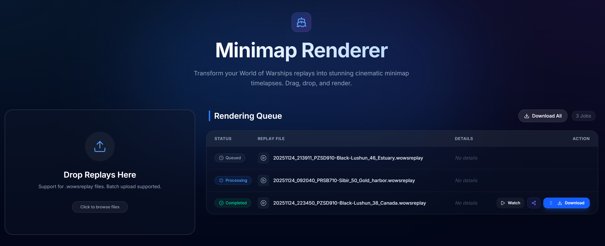

# Web Wrapper for Minimap Renderer



A web-based frontend for the Minimap Renderer, allowing users to upload replays and download rendered videos in the browser. See the minimap renderer project here: https://github.com/WoWs-Builder-Team/minimap_renderer

## Table of Contents
- [Prerequisites](#prerequisites)
- [Configuration](#configuration)
- [Running with npm](#running-with-npm)
- [Running with docker](#running-with-docker)
- [Admin UI](#admin-ui)
- [Usage](#usage)
- [Architecture](#architecture)
- [Roadmap](#roadmap)
- [Attribution](#attribution)

## Prerequisites
- Python 3.10+ (Python 3.14 is supported with the instructions below)
- Node.js and npm

## Configuration

The application is configured using environment variables. A `.env` file is used to store these variables locally.

1.  Copy `.env.example` to `.env`:
    ```bash
    cp .env.example .env
    ```
2.  Edit `.env` to customize your configuration.

| Variable | Description | Default |
| :--- | :--- | :--- |
| `BACKEND_PORT` | Port for the backend API. | `8000` |
| `ADMIN_PORT` | Port for the Admin UI. | `8001` |
| `FRONTEND_PORT` | Port for the Frontend. | `5173` |
| `MAX_WORKERS` | Number of parallel rendering workers. | `2` |
| `CLEANUP_HOURS` | Age of jobs (in hours) to automatically delete. | `24` |
| `DISCORD_WEBHOOKS` | JSON list of pre-defined Discord webhooks. | `[]` |

### Discord Webhooks

You can pre-define Discord webhooks in the `.env` file using the `DISCORD_WEBHOOKS` variable. This allows users to easily select a destination for their rendered videos.

**Format:**
```json
[{"name": "My Server", "url": "https://discord.com/api/webhooks/..."}]
```

When a render is complete, the webhook will send:
- The rendered video file.
- A formatted message containing:
    - **Player In Render**: The main player (usually the one recording).
    - **Other Players**: A list of all other players in the match.
    - **Builds**: Links to ship builds if available.

## Running with npm
### 1. Set up a Python Virtual Environment

To avoid compatibility issues with system packages or other projects, it is **highly recommended** to use a virtual environment.

1.  Navigate to the project root:
    ```bash
    cd c:/Users/USER/Desktop/minimap_renderer-master
    ```

2.  Create a virtual environment (named `venv`):
    ```bash
    python -m venv venv
    ```

3.  Activate the virtual environment:
    *   **Windows**:
        ```cmd
        .\venv\Scripts\activate.bat
        ```
    *   **Linux/Mac**:
        ```bash
        source venv/bin/activate
        ```

### 2. Install Backend Dependencies

The original `requirements.txt` may fail on newer Python versions due to strict version pinning. We have provided `requirements_modern.txt` with relaxed constraints for compatibility.

1.  Install the dependencies:
    ```bash
    pip install -r requirements_modern.txt
    ```

### 3. Install Frontend Dependencies

1.  Navigate to the frontend directory:
    ```bash
    cd web_wrapper/frontend
    ```

2.  Install Node modules:
    ```bash
    npm install
    ```

### 4. Run the Application

A helper script `run.py` is provided in the `web_wrapper` directory to start both the backend and frontend servers simultaneously.

1.  Navigate to the `web_wrapper` directory:
    ```bash
    cd ../
    ```

2.  Run the script (ensure your virtual environment is activated):
    ```bash
    python run.py
    ```

You should see output indicating that both services have started:
- **Backend**: http://localhost:8000
- **Frontend**: http://localhost:5173

## Running with docker

You can also run the entire application using Docker Compose.

1.  Ensure you have Docker and Docker Compose installed.
2.  Run the following command in the project root:
    ```bash
    docker compose up --build
    ```
3.  Access the application at `http://localhost:5173`.
4.  Access the Admin UI at `http://localhost:8001`.

## Admin UI

The application includes a dedicated Admin UI for managing jobs and viewing rendered content.

-   **URL**: `http://localhost:8001`
-   **Features**:
    -   **Job List**: View all processing, completed, and failed jobs.
    -   **Video Preview**: Watch rendered videos directly in the browser.
    -   **Player Info**: View detailed player information (Ship, Clan, Build) for each replay.
    -   **Delete All**: One-click cleanup of all jobs and files with a custom confirmation dialog.
    -   **Auto-Cleanup**: Automatically deletes jobs older than a configured number of hours (default: 24).


## Usage

1.  Open your browser to `http://localhost:5173`.
2.  **Upload**: Drag and drop your `.wowsreplay` files into the upload zone.
3.  **Queue**: Watch the status of your jobs in the list below.
4.  **Download**: Once a job is `completed`, click the "Download" button to get your MP4 video.

## Architecture

- **Backend**: FastAPI app (`backend/main.py`) that manages a job queue and executes the original `render` module via subprocess. It supports parallel rendering via `asyncio` tasks.
- **Admin Server**: A separate FastAPI app (`backend/admin_main.py`) running on port 8001 for management tasks.
- **Frontend**: React/Vite app (`frontend/`) with TailwindCSS for styling.
- **Database**: SQLite (`jobs.db`) for persisting job state.
- **Storage**:
    - Uploads are stored in `web_wrapper/backend/uploads`.
    - Generated videos are moved to `web_wrapper/backend/outputs`.

## Roadmap

- [x] Delete rendered videos after download or after a certain amount of time
- [ ] Uploading directly to discord
- [ ] Add support to customize the output video
- [x] Parallel Rendering
- [x] Admin Interface

## Attribution

This project uses the [Minimap Renderer](https://github.com/WoWs-Builder-Team/minimap_renderer) by the WoWs-Builder-Team.

